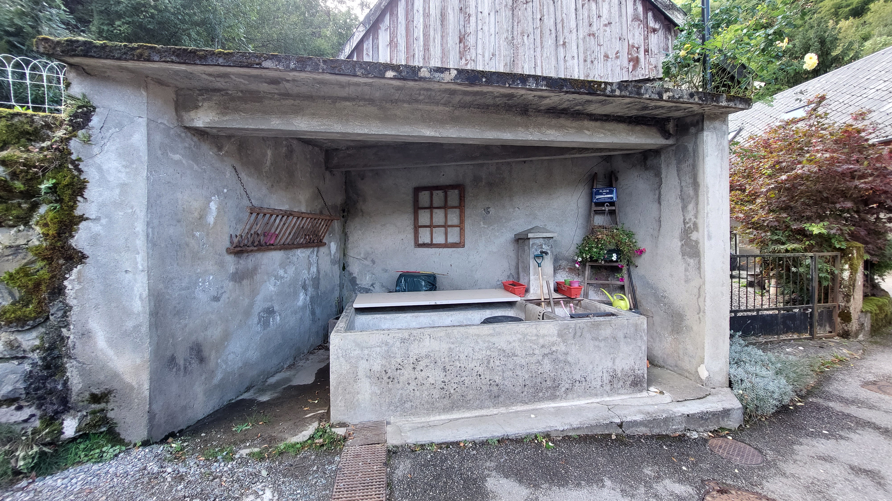

---
# Feel free to add content and custom Front Matter to this file.
# To modify the layout, see https://jekyllrb.com/docs/themes/#overriding-theme-defaults

layout: default
---

# 2023-09-23 Cartopartie Saint-Barthélemy-de-Sechilienne
Cartopartie du 23/09/2023 à Saint-Barthélemy-de-Séchilienne

- [Info sur la cartopartie](https://wiki.openstreetmap.org/wiki/Cartopartie_Saint-Barth%C3%A9lemy-de-S%C3%A9chilienne_23-09-2023)
- [Page Wikipédia du village](https://en.wikipedia.org/wiki/Saint-Barth%C3%A9lemy-de-S%C3%A9chilienne)
- [Infos sur la génération des gifs avant/après](gifs.md)

## Compte rendu de la cartopartie

En cette journée du 23/09/2023, nous avons été très chaleureusement accueillis par le personnel de mairie et bien évidemment Monsieur le maire : Gilles Strappazzon. Mr le maire nous a apporté une aide précieuse en nous indiquant tous les lieux remarques du village ainsi que toutes les petites pépites cachées : fontaines, lavoirs, canaux d'eau et même un cerisier remarquable :

Nous avons été accueilli dans l'une des salles flambant neuve attenantes à la nouvelle mairie. Après un bon café sympathiquement offert par la mairie et grignotages de viennoiseries apportées par Paul, nous avons commencé à nous répartir certaines zones à cartographier. C'est ainsi que Nicolas et moi-même sommes partis au lieu-dit des Ruines, où nous avons pu visiter la Chapelle Saint-François Régis :

| Vue extérieure | Vue intérieure |
|:--------------:|:--------------:|
|  |  |

Sur place, nous avons bien sûr utilisé l'excellente application [Every Door](https://wiki.openstreetmap.org/wiki/Every_Door) afin d'ajouter tous les [POI](https://wiki.openstreetmap.org/wiki/FR:Points_d%27int%C3%A9r%C3%AAt) trouvés sur place : panneaux de randos, containers de recyclage, etc. Voici une animation centrée sur le quartier des Ruines avant/après la cartopartie : 

Par la suite, nous avons dépéché une petite expédition en voiture dans la ville de Séchilienne. Objectif, cartographier un peu la zone et aller collecter les pizzas gracieusements offertes par l'association [OpenStreetMap France](https://www.openstreetmap.fr/). Nous étions 5 à parcourir les rues de Séchiliennes, téléphone à la main à faire chauffer [Every Door](https://wiki.openstreetmap.org/wiki/Every_Door), [StreetComplete](https://wiki.openstreetmap.org/wiki/StreetComplete) et [Vespucci](https://wiki.openstreetmap.org/wiki/Vespucci). Nous avons également enregistré quelques traces GPS avec [OsmAnd](https://wiki.openstreetmap.org/wiki/OsmAnd) pour ajouter un chemin entre deux quartiers de la ville. Voic un comparatif :

Par la suite, nous avons déssiné ce nouveau chemin sur [iD](https://wiki.openstreetmap.org/wiki/ID) une fois de retour à Saint-Barthélemy-de-Séchilienne pour nous restaurer :

L'après midi, je suis reparti explorer Saint-Barthélemy avec Nicolas, ci-dessous quelques photos de nos aventures :

| Nico in action | Un lavoir |
|:--------------:|:---------:|
|||

Une vue sur le village :

Par la suite, nous avons navigué à peu près dans tous les recoins du village, téléphone à la main pour ajouter les différents POI se présentant sur notre chemin.

Animation sur le centre du village :

Animation près de l'école :

Animation au nord du centre :

Vers l'ancienne centrale hydroélectrique :

Vers la menuiserie Atticora :

Vers Champ de la Cour :

Chemin sous le Broue :

De nombreux autres gif sont disponibles sur mon repo GitHub. Je me suis également amusé à utilisé différents rendu de carte.

Rendu OSM France :

Rendu "Humanitaire" :

## Un point sur les statistiques

Lors de cette cartopartie, 179 routes (en tout genre) ont été ajoutées, dont 50 pistes et 96 allées, la plupart étant des allées privées permettant d'accéder aux différentes habitations du village.

Côté numéro de rue (numéro de maison), nous sommes passé de 1 seul numéro renseigné à plus de 94 ! Un bon pas en avant, mais il reste du travail.

Voici les statistiques détaillées que j'ai généré via Osmosis :

|Objects                                    |2023-09-14|2023-09-23|Ajouts|
|-------------------------------------------|----------|----------|------|
|Routes, pistes, etc.                       |235       |414       |179   |
|Routes avec nom                            |69        |77        |8     |
|Allées                                     |9         |105       |96    |
|Pistes                                     |31        |81        |50    |
|Chemins                                    |67        |89        |22    |
|Portails                                   |1         |44        |43    |
|Noeuds highway (panneaux, passages piétons)|11        |24        |13    |
|Panneaux de stop                           |5         |6         |1     |
|Cédez le passage                           |0         |2         |2     |
|Arrêt de bus                               |5         |5         |0     |
|Passage piéton                             |1         |2         |1     |
|Magasins                                   |0         |1         |1     |
|Aménités                                   |21        |47        |26    |
|Parkings                                   |1         |8         |7     |
|Places de parking                          |0         |1         |1     |
|Noeuds parking à convertir en way          |0         |0         |0     |
|Parkings à vélo                            |0         |2         |2     |
|Pistes cyclables dédiées                   |6         |6         |0     |
|Lignes cyclables                           |15        |15        |0     |
|Microbibliothèques                         |0         |0         |0     |
|Bibliothèques                              |1         |1         |0     |
|Lieux (hameaux, village, ...)              |17        |17        |0     |
|Bâtiments                                  |572       |593       |21    |
|Chapelles                                  |1         |3         |2     |
|Églises                                    |1         |1         |0     |
|Abris                                      |0         |1         |1     |
|Murs                                       |0         |58        |58    |
|Haies                                      |0         |85        |85    |
|Numéros de rue                             |1         |94        |93    |
|Mémoriaux                                  |0         |1         |1     |
|Croix historiques                          |0         |1         |1     |
|Croix religieuses                          |1         |2         |1     |
|Objets touristiques                        |19        |37        |18    |
|Points d'eau potable                       |10        |1         |-9    |
|Containers de recyclage                    |1         |3         |2     |
|Ecoles                                     |1         |1         |0     |
|Boites aux lettres jaunes                  |1         |1         |0     |
|Fontaines                                  |0         |7         |7     |
|Lavoirs                                    |0         |4         |4     |
|Toilettes                                  |0         |1         |1     |
|Objets avec horaires d'ouverture           |0         |1         |1     |
|Panneaux d'information                     |0         |2         |2     |
|Bancs                                      |0         |6         |6     |
|Lampadaires                                |0         |9         |9     |
|Poubelles pour piétons                     |0         |1         |1     |
|Container poubelle                         |0         |1         |1     |
|Points de vue                              |6         |7         |1     |
|Arbres                                     |26        |54        |28    |
|Rangées d'arbres                           |0         |6         |6     |
|Panneaux de randonnée/vélo                 |12        |18        |6     |
|Cartes/plans                               |1         |1         |0     |
|Tables de pique-nique                      |0         |1         |1     |
|Aires de jeux                              |0         |0         |0     |
|Terrains/Equipements sportifs              |1         |3         |2     |
|Piscines                                   |8         |36        |28    |
|Bouches à incendie                         |0         |13        |13    |
|Artisans                                   |0         |1         |1     |
|Fixmes                                     |1         |0         |-1    |
|Objets Wikidata                            |0         |4         |4     |

Les curieux pourront se tourner vers mon script cityStats.sh dans mon repo GitHub.

Voici un graphique produit par [ohsomeNow Stats](https://stats.now.ohsome.org/dashboard#hashtags=CartopartieSBDS&start=2023-07-27T00:00:00.000Z&end=2023-09-23T20:39:31.000Z&interval=P1D) montrant nos éditions du jour, heure par heure pour le hashtag #CartopartieSBDS :

Un autre graphique avec toutes les éditions par jour entre le 27 Juillet et le 24 septembre :

On peut voir, qu'un gros travail a été effectué avant le jour J. Pour ma part, j'ai beaucoup cartographié grâce aux imageries aériennes afin d'ajouter le plus d'éléments visibles : bâtiments, routes, haies, murs, etc. Je me suis dit que ce travail préliminaire permettrait de faciliter notre tâche sur le terrain et notamment pourrait faire apparaitre plus de quêtes sur StreetComplete une fois sur place.

Parlant de StreetComplete, je comptabilise plus de [84 changesets](https://osmcha.org/?filters=%7B%22editor%22%3A%5B%7B%22label%22%3A%22StreetComplete%22%2C%22value%22%3A%22StreetComplete%22%7D%5D%2C%22geometry%22%3A%5B%7B%22label%22%3A%7B%22coordinates%22%3A%5B%5B%5B5.797132%2C45.058885%5D%2C%5B5.797132%2C45.028651%5D%2C%5B5.851333%2C45.028651%5D%2C%5B5.851553%2C45.059195%5D%2C%5B5.797132%2C45.058885%5D%5D%5D%2C%22type%22%3A%22Polygon%22%7D%2C%22value%22%3A%7B%22coordinates%22%3A%5B%5B%5B5.797132%2C45.058885%5D%2C%5B5.797132%2C45.028651%5D%2C%5B5.851333%2C45.028651%5D%2C%5B5.851553%2C45.059195%5D%2C%5B5.797132%2C45.058885%5D%5D%5D%2C%22type%22%3A%22Polygon%22%7D%7D%5D%7D) faits avec StreetComplete. NB : StreetComplete ne permettant pas (sauf erreur de ma part) d'ajouter un hashtag à nos contributions, il faudra donc ajouter ces 84 changesets à notre total.

Le site [resultmaps](https://resultmaps.neis-one.org/osm-changesets?comment=CartopartieSBDS#12/45.0373/5.8125) permet d'obtenir des stats sympa concernant le hashtag #CartopartieSBDS mais uniquement sur les 30 derniers jours. Voici la carte des changesets tracés par cet outils :

| Centré sur le village | Vue plus large |
|:---------------------:|:--------------:|
||

Graphique du nombre de changeset en rose (axe y de gauche) et du nombre de contributeurs (axe y de droite):

Voici les informations affichées par cet outil pour le tag #CartopartieSBDS :
- Nombre de contributeurs : 5
- Nombre de modifications : 6,214
- Nombre de Changesets: 210

Nombre d'objets OSM créés (modifiés) (supprimés) :
- Noeuds OSM : 3,855 (1,068) (297)
- Chemin OSM : 495 (483) (13)
- Routes/Highways: 230 (183)
- Bâtiments : 46
- Usage du terrain/Land-uses : 23
- Chemins d'eau/Waterways : 7

On peut voir que cette cartopartie a été particulièrement productive. Avec plus de 6 214 modifications de cartes ! Un très bon score ! Surtout qu'il faudrai ajouter les modifications apportées par StreetComplete.

## Conclusion

Une bien belle journée organisée d'une main de maître par Paul. Merci à tous les contributeurs présents :
- [barnes38](https://www.openstreetmap.org/user/barnes38) (alias Paul)
- [NicolasGrosjean](https://www.openstreetmap.org/user/NicolasGrosjean)
- [chimel38](https://www.openstreetmap.org/user/chimel38)
- [ArnoPoit](https://www.openstreetmap.org/user/ArnoPoit)
- [tetsuosp](https://www.openstreetmap.org/user/tetsuosp)
- [cyril_leblanc](https://www.openstreetmap.org/user/cyril_leblanc)
- [Binnette](https://www.openstreetmap.org/user/Binnette) (moi-même)

Merci également à Mr le maire Gilles Strappazzon et au personnel de la mairie pour leur chaleureux accueil, les précieux renseignements, anecdotes et histoires partagés au cours de la journée.

Merci également à [OpenStreetMap France](https://www.openstreetmap.fr/) pour le sponsoring financier qui a permis de payer notre repas du midi.

Une dernière petite animation montrant plus particulièrement les modifications de land-use :

Merci d'avoir lu ce compte-rendu ! Retrouvez-nous en personne lors de l'un de nos prochains atelier à Grenoble, voir la page [Agenda](https://wiki.openstreetmap.org/wiki/Grenoble_groupe_local/Agenda) du Groupe local OSM grenoblois. Et si vous aussi, vous êtes intéressé par une cartopartie dans votre ville/village, parlez en à vos élus/maires et contactez nous par mail via : [contact-grenoble@listes.openstreetmap.fr](mailto:contact-grenoble@listes.openstreetmap.fr)