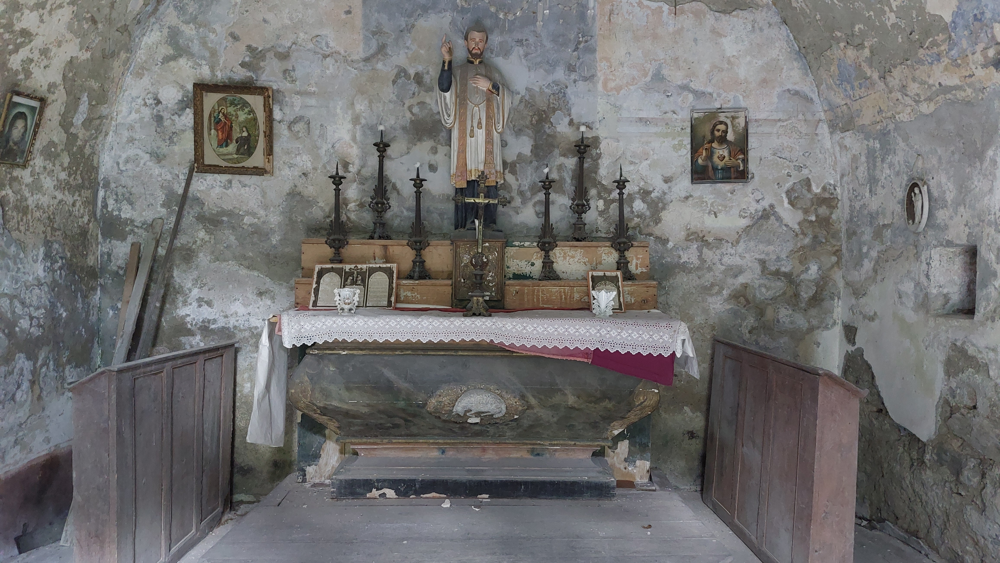
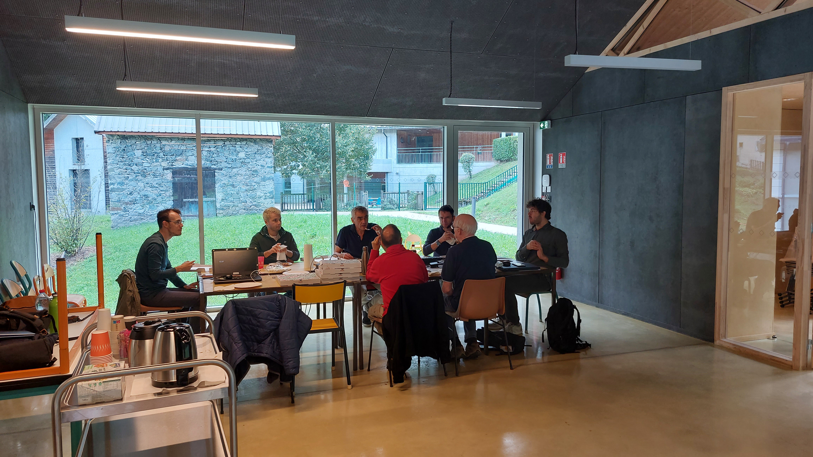
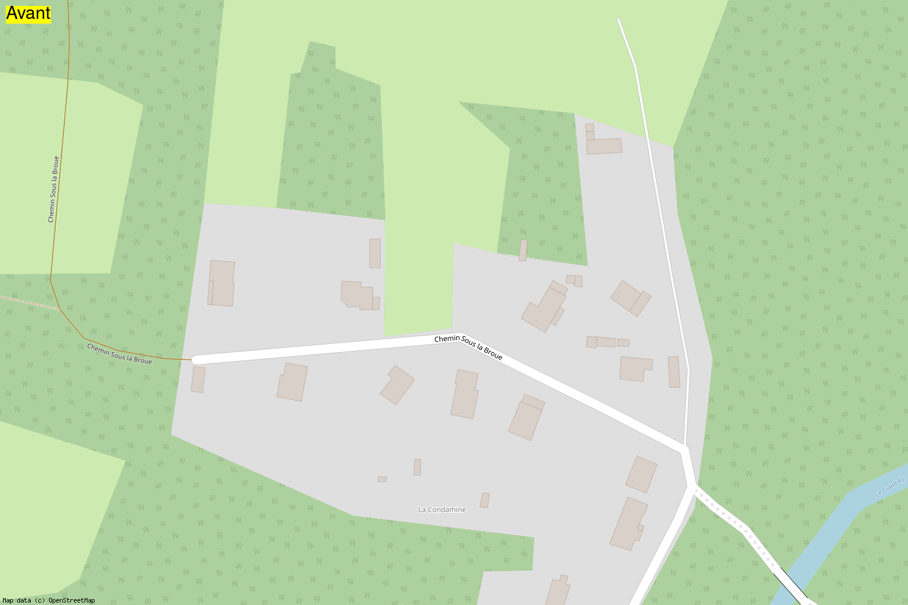

---
# Feel free to add content and custom Front Matter to this file.
# To modify the layout, see https://jekyllrb.com/docs/themes/#overriding-theme-defaults

layout: default
---

# 2023-09-23 Cartopartie Saint-Barthélemy-de-Sechilienne
Cartopartie du 23/09/2023 à Saint-Barthélemy-de-Séchilienne

- [Info sur la cartopartie](https://wiki.openstreetmap.org/wiki/Cartopartie_Saint-Barth%C3%A9lemy-de-S%C3%A9chilienne_23-09-2023)
- [Page Wikipédia du village](https://fr.wikipedia.org/wiki/Saint-Barth%C3%A9lemy-de-S%C3%A9chilienne)
- [Info on generating before/after gifs](gifs.md)

## CMapathon report

On this day of 09/23/2023, we were very warmly welcomed by the town hall staff and of course the mayor: Gilles Strappazzon. The mayor provided us with invaluable help by pointing out all the remarkable places in the village as well as all the hidden gems: fountains, wash houses, water channels and even a remarkable cherry tree:

We were welcomed in one of the brand new rooms adjoining the new town hall. After a good coffee kindly offered by the town hall and pastries brought by Paul, we started to divide up certain areas to map. This is how Nicolas and I went to the place called Ruines, where we were able to visit the Chapel of Saint-François Régis:

| Exterior View | Interior View |
|:-------------:|:-------------:|
|  |  |

On site, we of course used the excellent application [Every Door](https://wiki.openstreetmap.org/wiki/Every_Door) to add all the [POI](https://wiki.openstreetmap.org/wiki/FR:Points_d%27int%C3%A9r%C3%AAt) found on site: hiking signs, recycling containers, etc. Here is an animation centered on the Ruines neighborhood before/after the mapathon:

Subsequently, we dispatched a small car expedition in the town of Séchilienne. Objective, to map a bit of the area and go collect pizzas graciously offered by the association [OpenStreetMap France](https://www.openstreetmap.fr/). We were 5 walking through the streets of Séchiliennes, phone in hand to heat up [Every Door](https://wiki.openstreetmap.org/wiki/Every_Door), [StreetComplete](https://wiki.openstreetmap.org/wiki/StreetComplete) and [Vespucci](https://wiki.openstreetmap.org/wiki/Vespucci). We also recorded some GPS traces with [OsmAnd](https://wiki.openstreetmap.org/wiki/OsmAnd) to add a path between two neighborhoods of the city. Here is a comparison:

Subsequently, we drew this new path on [iD](https://wiki.openstreetmap.org/wiki/ID) once back in Saint-Barthélemy-de-Séchilienne to restore us:

In the afternoon, I went back to explore Saint-Barthélemy with Nicolas, below are some photos of our adventures:

| Nico in action | A washing place |
|:--------------:|:---------------:|
|||

A view of the village:

After, we navigated just about every corner of the village, phone in hand to add different POIs that came our way.

Animation on the village center:

Animation near school:

Animation north of center:

Towards the old hydroelectric power station:

Towards the Atticora carpentry:

Towards Champ de la Cour:

Chemin sous le Broue :

Many other gifs are available on my GitHub repo. I also had fun using different map renderings.

OSM France rendering:

"Humanitarian" rendering:

## A point on statistics

During this mapathon, 179 roads (of all kinds) were added, including 50 tracks and 96 alleys, most of which are private driveways to access the various houses in the village.

On the house number side (house number), we went from only 1 number listed to more than 94! A good step forward, but there is still work to be done.

Here are the detailed statistics that I generated via Osmosis:

|Objects                                    |2023-09-14|2023-09-23|Added |
|-------------------------------------------|----------|----------|------|
|Roads, tracks, etc.                        |235       |414       |179   |
|Roads with name                            |69        |77        |8     |
|Alleys                                     |9         |105       |96    |
|Tracks                                     |31        |81        |50    |
|Paths                                      |67        |89        |22    |
|Gates                                      |1         |44        |43    |
|Highway nodes (signs, pedestrian crossings)|11        |24        |13    |
|Stop signs                                 |5         |6         |1     |
|Give way                                   |0         |2         |2     |
|Bus stop                                   |5         |5         |0     |
|Pedestrian crossing                        |1         |2         |1     |
|Shops                                      |0         |1         |1     |
|Amenities                                  |21        |47        |26    |
|Parkings                                   |1         |8         |7     |
|Parking spaces                             |0         |1         |1     |
|Parking nodes to convert to way            |0         |0         |0     |
|Bike parkings                              |0         |2         |2     |
|Dedicated bike lanes                       |6         |6         |0     |
|Bike lanes                                 |15        |15        |0     |
|Public bookcases                           |0         |0         |0     |
|Libraries                                  |1         |1         |0     |
|Places (hamlets, village, ...)             |17        |17        |0     |
|Buildings                                  |572       |593       |21    |
|Chapels                                    |1         |3         |2     |
|Churches                                   |1         |1         |0     |
|Shelters                                   |0         |1         |1     |
|Walls                                      |0         |58        |58    |
|Hedges                                     |0         |85        |85    |
|Street numbers                             |1         |94        |93    |
|Memorials                                  |0         |1         |1     |
|Historical crosses                         |0         |1         |1     |
|Religious crosses                          |1         |2         |1     |
|Tourist objects                            |19        |37        |18    |
|Drinking water points                      |10        |1         |-9    |
|Recycling containers                       |1         |3         |2     |
|Schools                                    |1         |1         |0     |
|Yellow mailboxes                           |1         |1         |0     |
|Fountains                                  |0         |7         |7     |
|Wash houses                                |0         |4         |4     |
|Toilets                                    |0         |1         |1     |
|Objects with opening hours                 |0         |1         |1     |
|Information signs                          |0         |2         |2     |
|Benches                                    |0         |6         |6     |
|Streetlights                               |0         |9         |9     |
|Pedestrian trash cans                      |0         |1         |1     |
|Trash container                            |0         |1         |1     |
|Viewpoints                                 |6         |7         |1     |
|Trees                                      |26        |54        |28    |
|Rows of trees                              |0         |6         |6     |
|Hiking/biking signs                        |12        |18        |6     |
|Maps/plans                                 |1         |1         |0     |
|Picnic tables                              |0         |1         |1     |
|Playgrounds                                |0         |0         |0     |
|Sports fields/Equipment                    |1         |3         |2     |
|Swimming pools                             |8         |36        |28    |
|Fire hydrants                              |0         |13        |13    |
|Craftsmen                                  |0         |1         |1     |
|Fixmes                                     |1         |0         |-1    |
|Wikidata objects                           |0         |4         |4     |

Curious people can turn to my [cityStats.sh](stats/cityStats.sh) script in my GitHub repo.

Here is a graph produced by [ohsomeNow Stats](https://stats.now.ohsome.org/dashboard#hashtags=CartopartieSBDS&start=2023-07-27T00:00:00.000Z&end=2023-09-23T20:39:31.000Z&interval=P1D) showing our edits of the day, hour by hour for the hashtag #CartopartieSBDS:

Another graph with all the edits per day between July 27 and September 24:

We can see that a lot of work was done before D-Day. For my part, I mapped a lot thanks to aerial imagery to add as many visible elements as possible: buildings, roads, hedges, walls, etc. I thought this preliminary work would make our task on the field easier and could bring up more quests on StreetComplete once on site.

Speaking of StreetComplete, I count more than [84 changesets](https://osmcha.org/?filters=%7B%22editor%22%3A%5B%7B%22label%22%3A%22StreetComplete%22%2C%22value%22%3A%22StreetComplete%22%7D%5D%2C%22geometry%22%3A%5B%7B%22label%22%3A%7B%22coordinates%22%3A%5B%5B%5B5.797132%2C45.058885%5D%2C%5B5.797132%2C45.028651%5D%2C%5B5.851333%2C45.028651%5D%2C%5B5.851553%2C45.059195%5D%2C%5B5.797132%2C45.058885%5D%5D%5D%2C%22type%22%3A%22Polygon%22%7D%2C%22value%22%3A%7B%22coordinates%22%3A%5B%5B%5B5.797132%2C45.058885%5D%2C%5B5.797132%2C45.028651%5D%2C%5B5.851333%2C45.028651%5D%2C%5B5.851553%2C45.059195%5D%2C%5B5.797132%2C45.058885%5D%5D%5D%2C%22type%22%3A%22Polygon%22%7D%7D%5D%7D) made with StreetComplete. NB: StreetComplete does not allow (unless I'm mistaken) to add a hashtag to our contributions, so we will have to add these 84 changesets to our total.

The site [resultmaps](https://resultmaps.neis-one.org/osm-changesets?comment=CartopartieSBDS#12/45.0373/5.8125) provides nice stats about the hashtag #CartopartieSBDS but only for the last 30 days. Here is the map of changesets traced by this tool:

| Centered on the village | Wider view |
|:-----------------------:|:--------------:|
||

Graph of the number of changeset in pink (left y-axis) and the number of contributors (right y-axis):

Here is the information displayed by this tool for the tag #CartopartieSBDS:
- Number of OSM Contributors: 5
- Number of Map Changes: 6,214
- Total number of Changesets: 210

Number of created (modified) (deleted) OSM Objects
- Nodes: 3,855 (1,068) (297)
- Ways: 495 (483) (13)
- Highways: 230 (183)
- Buildings: 46
- Land-uses: 23
- Waterways: 7

We can see that this mapathon was particularly productive. With more than 6,214 map modifications! A very good score! Especially since we would have to add the modifications made by StreetComplete.

## Conclusion

A beautiful day masterfully organized by Paul. Thanks to all the contributors present:
- [barnes38](https://www.openstreetmap.org/user/barnes38) (alias Paul)
- [NicolasGrosjean](https://www.openstreetmap.org/user/NicolasGrosjean)
- [chimel38](https://www.openstreetmap.org/user/chimel38)
- [ArnoPoit](https://www.openstreetmap.org/user/ArnoPoit)
- [tetsuosp](https://www.openstreetmap.org/user/tetsuosp)
- [cyril_leblanc](https://www.openstreetmap.org/user/cyril_leblanc)
- [Binnette](https://www.openstreetmap.org/user/Binnette) (myself)

Also thanks to Mr Mayor Gilles Strappazzon and the town hall staff for their warm welcome, valuable information, anecdotes and stories shared throughout the day.

Also thanks to [OpenStreetMap France](https://www.openstreetmap.fr/) for the financial sponsorship which allowed us to pay for our lunch.

One last little animation showing more particularly the modifications of land-use:

Thank you for reading this report! Join us in person at one of our upcoming workshops in Grenoble, see the [Agenda](https://wiki.openstreetmap.org/wiki/Grenoble_groupe_local/Agenda) page of the local OSM Grenoble group. And if you too are interested in a mapathon in your city/village, talk to your elected officials/mayors and contact us by email via: [contact-grenoble@listes.openstreetmap.fr](mailto:contact-grenoble@listes.openstreetmap.fr)